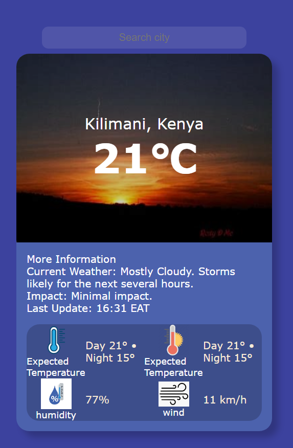

# Weather App

This project is a simple weather app to get the weather info of any city around the world.

## Building and deploying

To deploy the app, use ng build and the include the "build:prod": "ng build --c=production" in your package.json file. You can then deploy it on netlify

### This app runs on (https://getweatherinfobyowen.netlify.app/)

Searching for a new city takes sometime because the data in the api is a lot. Also the api used is from rapidapi and for free subscriptions there is a limit to the number of "GET" requests per month. The app will not display if this limit is passed.

---

---

